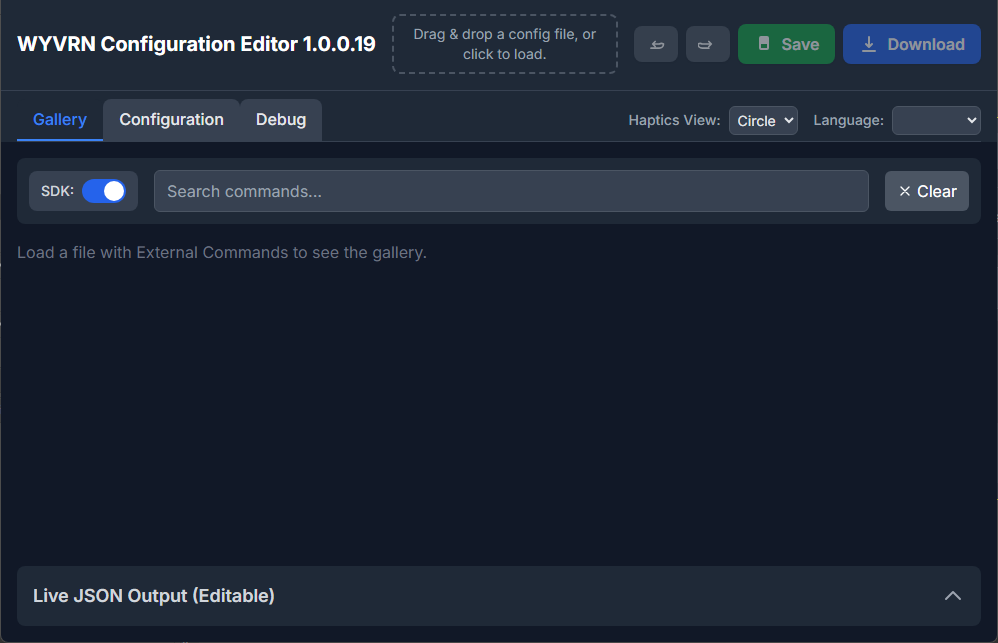
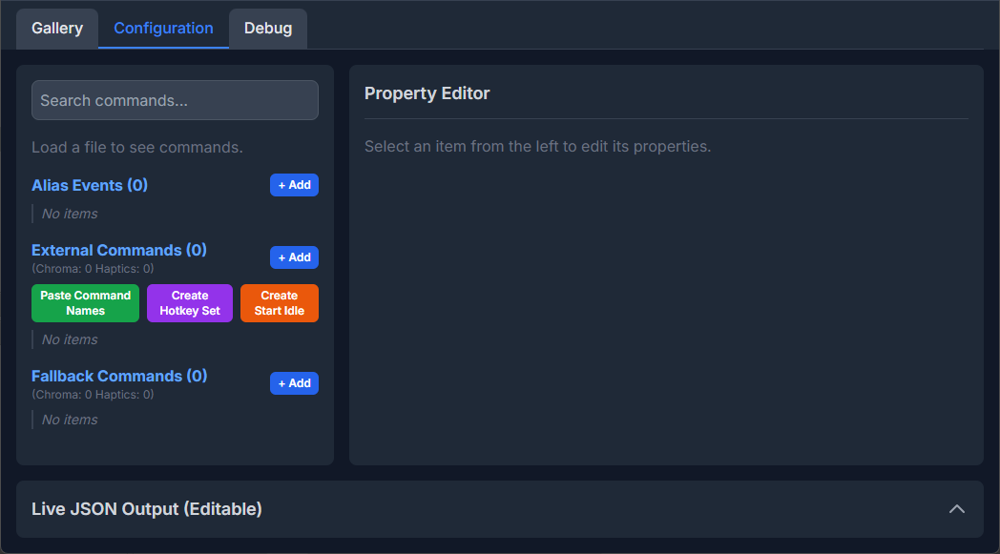
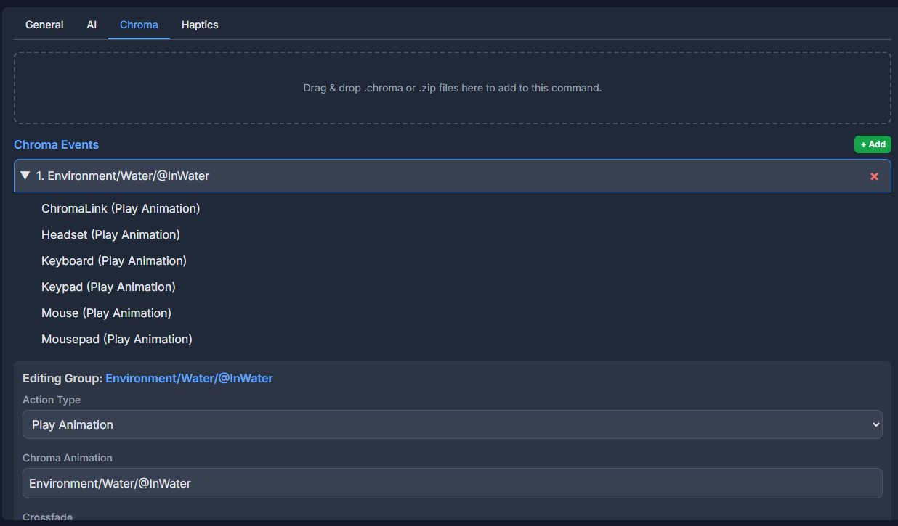

# WYVRN Configuration Editor

The `WYVRN` Configuration Editor is a GUI tool for creating and editing `WYVRN` configuration files that control how games react to game events. Use the `WYVRN SDK` with event names created in the editor that are fed to the `SetEventName` method to trigger playback.

Find the latest `WYVRN` Configuration Editor in [Releases](https://github.com/WyvrnOfficial/WyvrnConfigurationEditor/releases).

Use the editor to open `WYVRN` configurations found within the subfolders distributed by [Razer Synapse](https://www.razer.com/synapse-4).

```
C:\Program Files (x86)\InterHaptics\HapticFolders
```

Check out the [WYVRN Effects Library](https://doc.wyvrn.com/tools/WyvrnEffectsLibrary/) to see a configuration that was created with the editor.


# Tab - Gallery

The editor has a gallery tab that is very similar to the `WYVRN Effects Library` tool.



## Toggle - SDK

Playback buttons appear next to each event name that allow playback on local hardware when the `SDK` toggle is checked.


# Tab - Configuration

The configuration tab displays lists of aliases, external commands, and fallbacks with each being selectable so their properties can be edited in the `Property Editor`. The lists display tags to make finding specific content easier.



## Configuration - Alias

Alias events can map an incoming event name to another event name. This is useful in case the incoming event has a typo and needs rerouted to the expected event.


## Configuration - External Commands

With an external command selected, the property editor has tabs for `General`, `AI`, `Chroma`, and `Haptics`.


### Property Editor - General

The `General` tab has an editor for the `External Command ID` which is the identifier that is triggered by `SetEventName`. Commands have a description that appears in the gallery. Commands can interrupt other commands which can be used to stop playback for a previous command.


### Property Editor - Chroma

The `Chroma` tab supports editing individual `Chroma` events and groups of `Chroma` events.



`Chroma` events have an `Action Type` each with a different set of properties.


### Property Editor - Haptics

The haptics tab manages haptic events and targeting. Haptic events can have multiple targets that can be found by scrolling down in the property editor.


## Live JSON Output

Any UI changes automatically updates the JSON configuration at the bottom of the page.


# Tab - Debug

The `Debug` tab links to diagnostic tools and lists any unreferenced assets that might be missing from the configuration.


